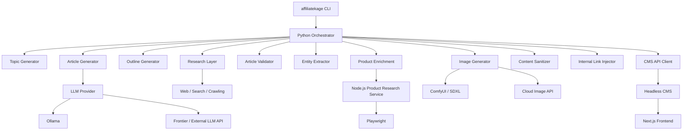
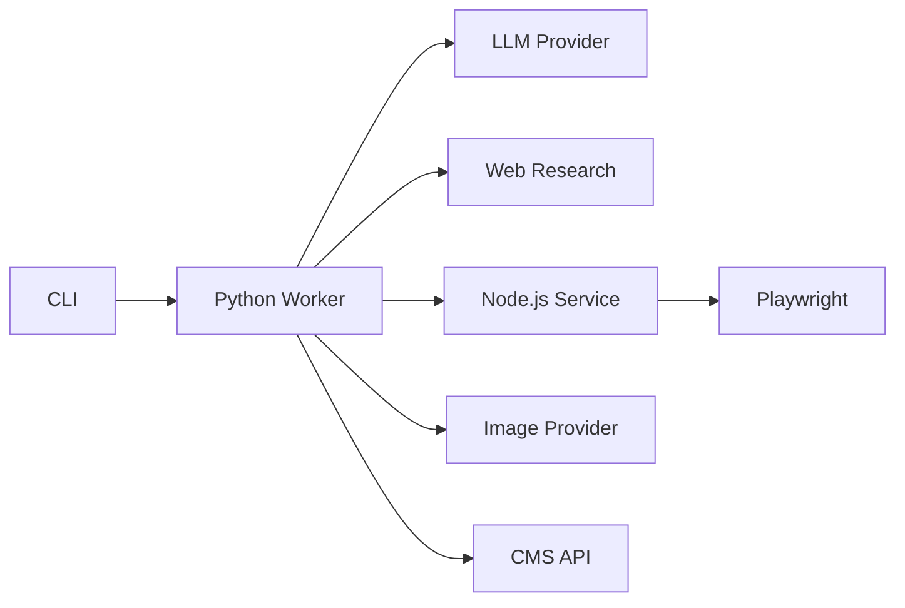

# 🥷 AffiliateKage 影

### Autonomous AI Content Research, Product Intelligence & Affiliate Publishing Engine

[](https://ejiroinspire.com)
[](https://www.python.org/)
[](https://nodejs.org/)
[](https://ollama.ai/)
[](https://github.com/comfyanonymous/ComfyUI)
[](LICENSE)

> **Research → Generate → Enrich → Render → Validate → Publish**

AffiliateKage is an end-to-end autonomous content production and affiliate publishing engine.

It orchestrates topic discovery, web research, structured content generation, entity extraction, product intelligence, affiliate enrichment, image generation, SEO processing, and CMS publication as a single local application.

The system is **provider-agnostic at the AI layer**. Local inference through Ollama is supported, but the content-generation architecture is designed so that an external frontier model or another LLM API can be substituted without redesigning the publishing pipeline.

The same principle applies to image generation: local ComfyUI/SDXL and cloud image APIs are interchangeable backends behind the image-generation layer.

### Production Showcase

AffiliateKage currently powers the automated publishing workflow behind **[ejiroinspire.com](https://ejiroinspire.com)**.

---

# Table of Contents

* [Architecture](#architecture)
* [Pipeline](#pipeline)
* [AI Provider Architecture](#ai-provider-architecture)
* [Features](#features)
* [System Requirements](#system-requirements)
* [Installation](#installation)
* [Installer](#installer)
* [Configuration](#configuration)
* [Running the Engine](#running-the-engine)
* [CLI Reference](#cli-reference)
* [Product Research Service](#product-research-service)
* [Image Generation](#image-generation)
* [Content Processing](#content-processing)
* [CMS Integration](#cms-integration)
* [State & Recovery](#state--recovery)
* [Project Structure](#project-structure)
* [Component Responsibilities](#component-responsibilities)
* [Service Communication](#service-communication)
* [Security](#security)
* [Troubleshooting](#troubleshooting)
* [Development](#development)
* [Extending AffiliateKage](#extending-affiliatekage)
* [Roadmap](#roadmap)
* [Contributing](#contributing)
* [License](#license)

---

# Architecture

AffiliateKage is composed of a Python orchestration layer and a Node.js browser-automation service.



The Python process is the primary orchestrator.

The Node.js service is isolated because browser automation has fundamentally different runtime and dependency requirements from the content-generation pipeline.

---

# Pipeline

A complete execution follows this general state machine:

```text
TOPIC
  │
  ▼
RESEARCH
  │
  ▼
OUTLINE
  │
  ▼
GENERATE
  │
  ▼
VALIDATE
  │
  ▼
EXTRACT ENTITIES
  │
  ├───────────────┐
  ▼               ▼
PHYSICAL       DIGITAL
PRODUCT        ENTITY
  │               │
  ▼               ▼
PRODUCT         URL /
RESEARCH        AFFILIATE
  │             ROUTING
  └───────┬───────┘
          ▼
       ENRICH
          │
          ▼
     IMAGE GENERATION
          │
          ▼
       SANITIZE
          │
          ▼
     INTERNAL LINKS
          │
          ▼
        PUBLISH
```

Each stage has a distinct responsibility.

This separation makes it possible to replace an individual provider or implementation without rewriting the entire pipeline.

---

# AI Provider Architecture

One of AffiliateKage's core design principles is **provider independence**.

The content-generation system is not fundamentally coupled to Ollama.

Ollama is simply one implementation of the LLM backend.

```text
                    ┌─────────────────────┐
                    │   Article Generator │
                    └──────────┬──────────┘
                               │
                         LLM Interface
                               │
             ┌─────────────────┼─────────────────┐
             │                 │                 │
             ▼                 ▼                 ▼
          Ollama          Frontier API      Other Backend
             │                 │                 │
             ▼                 ▼                 ▼
       Local Models       Cloud Models       Custom Model
```

This allows the same publishing pipeline to use:

* Local Ollama models
* Frontier LLM APIs
* Hosted inference providers
* Self-hosted inference servers
* Future provider implementations

For example:

```text
OLLAMA
Qwen
Llama
Mistral
```

can be replaced by an API-backed model such as a frontier-class model without changing the downstream publishing stages.

The important boundary is:

```text
Article Generator
       ↓
   LLM Backend
       ↓
Generated Content
```

The article generator should consume model output, not depend on where that output was produced.

---

# Image Provider Architecture

Images follow the same abstraction.

```text
                Image Generator
                      │
                Image Provider
                      │
        ┌─────────────┼─────────────┐
        ▼             ▼             ▼
     ComfyUI       OpenAI       Stability
      SDXL           API           API
        │             │             │
        └─────────────┼─────────────┘
                      ▼
                  Hero Image
```

This means a deployment does not need a local GPU.

A local deployment can use:

```env
IMAGE_PROVIDER=comfyui
```

while a cloud deployment can use:

```env
IMAGE_PROVIDER=openai
```

or:

```env
IMAGE_PROVIDER=stability
```

---

# Features

## Autonomous Topic Generation

Generates commercial content opportunities across multiple editorial formats:

* Reviews
* Buying Guides
* Comparisons
* Alternatives
* Tutorials
* Product Roundups
* Software Comparisons

The topic stage can also query the existing content inventory to avoid generating duplicate subjects or unnecessary variations of existing articles.

---

## Grounded Web Research

Research occurs before article generation.

The research layer uses search and crawling to construct an external-information context for the LLM.

Typical information includes:

* Product specifications
* Feature sets
* Pricing
* Competitor information
* Use cases
* Industry context
* Supporting evidence

Conceptually:

```text
Search Query
     ↓
Candidate Sources
     ↓
Crawler
     ↓
Page Extraction
     ↓
Relevant Information
     ↓
Research Context
```

---

## Structured Generation

AffiliateKage separates research, outlining, and writing rather than performing everything in one LLM request.

```text
Research
   ↓
Outline
   ↓
Article
```

This provides a deterministic intermediate representation that can be validated before the final content is generated.

---

## Entity Classification

The entity extraction stage distinguishes between physical products and digital products/services.

```text
Entity
  │
  ├── Physical Product
  │       ↓
  │   Product Enrichment
  │
  └── Digital Entity
          ↓
      URL / Affiliate Router
```

This prevents software and SaaS products from being processed through a physical-product workflow.

---

## Product Intelligence

Physical products can be sent to the Node.js product-research service.

The service can extract structured information such as:

* Product titles
* ASINs
* Product images
* Ratings
* Review counts
* Availability indicators
* Other page metadata

The resulting data is returned to the Python pipeline for enrichment.

---

## Product Showcase Injection

Enriched products can be converted into reusable publication components.

A product card may contain:

* Product image
* Product title
* Rating
* Review count
* Editorial label
* Key information
* Affiliate CTA

The product-card layer is implemented during content processing rather than being generated directly by the LLM.

---

## SEO Processing

Before publication, the content layer can perform:

* Heading normalization
* Markdown → HTML conversion
* Link sanitization
* Affiliate disclosure insertion
* Sponsored-link attributes
* Internal-link injection
* Product-card insertion
* Content cleanup

Example link attributes:

```html
rel="nofollow sponsored noopener"
```

---

# System Requirements

## Operating Systems

Recommended:

* Arch Linux
* Ubuntu
* Debian
* macOS

Linux is the primary development environment.

---

## Python

Python 3.10+.

```bash
python --version
```

---

## Node.js

Node.js 18+.

```bash
node --version
```

---

## Ollama

Ollama is required when using the local LLM backend.

```bash
ollama list
```

It is **not an architectural requirement for the content-generation layer** if another configured LLM provider is used.

---

## Chromium

Required by the browser-automation service.

Playwright can install its managed browser:

```bash
playwright install chromium
```

---

## ComfyUI

Required only when:

```env
IMAGE_PROVIDER=comfyui
```

is selected.

---

# Installation

AffiliateKage provides a **one-command installer** for the recommended setup.

## 1. Clone the repository

```bash
git clone https://github.com/Joshualeexy/AffiliateKage.git
cd AffiliateKage
```

## 2. Run the installer

```bash
chmod +x install.sh
./install.sh
```

That's the primary installation path.

After the installer completes, configure the generated environment and start the engine:

```bash
affiliatekage start
```

---

# Installer

`install.sh` is the project's automated bootstrap script.

Its purpose is to turn a clean machine into a usable AffiliateKage environment without requiring the user to manually perform every setup step.

The installer is responsible for preparing the runtime environment, including the project's Python environment, dependencies, browser dependencies, Node.js scraper dependencies, and CLI installation.

Conceptually:

```text
install.sh
   │
   ├── Check prerequisites
   │
   ├── Prepare Python environment
   │
   ├── Install Python dependencies
   │
   ├── Prepare Playwright
   │
   ├── Install Chromium
   │
   ├── Install Node dependencies
   │
   ├── Configure CLI
   │
   └── Finish installation
```

After installation:

```bash
affiliatekage status
```

can be used to verify the installation.

> If you modify `install.sh`, keep it idempotent where possible: rerunning the installer should repair or complete an incomplete installation rather than unnecessarily destroying an existing environment.

---

# Manual Installation

The installer is recommended, but the components can be installed manually.

## Python environment

```bash
python -m venv venv
source venv/bin/activate

pip install -r requirements.txt
playwright install chromium
```

## Node.js service

```bash
cd customamazonscraper
npm install
cd ..
```

## CLI

```bash
chmod +x affiliatekage

mkdir -p ~/.local/bin
ln -sf "$(pwd)/affiliatekage" ~/.local/bin/affiliatekage
```

Verify:

```bash
which affiliatekage
```

---

# Configuration

Create the main environment file:

```bash
cp .env.example .env
```

Example:

```env
# ==========================================
# LLM (Provider Agnostic)
# ==========================================

# Provider: ollama | openrouter | openai | deepseek | groq
LLM_PROVIDER=ollama

# Model identifier:
# - Ollama:     qwen3-coder:30b, llama3.3:70b, deepseek-r1:70b
# - OpenRouter: anthropic/claude-3.5-sonnet, openai/gpt-4o, google/gemini-2.5-pro
# - OpenAI:     gpt-4o, o3-mini
LLM_MODEL=qwen3-coder:30b

# Cloud LLM API Key (Required for openrouter, openai, deepseek, groq)
# LLM_API_KEY=sk-or-v1-...
# OPENAI_API_KEY=sk-...

# Custom Base URL (Optional - for Groq, Together, vLLM, LocalAI)
# LLM_BASE_URL=https://api.groq.com/openai/v1


# ==========================================
# CMS
# ==========================================

API_URL=https://api.yourdomain.com/api/admin
API_TOKEN=your_bearer_token_here


# ==========================================
# AFFILIATE
# ==========================================

AMAZON_AFFILIATE_TAG=yourtag-20


# ==========================================
# IMAGE PROVIDER
# ==========================================

# comfyui | openai | stability | fallback
IMAGE_PROVIDER=comfyui


# ==========================================
# COMFYUI
# ==========================================

COMFY_URL=http://127.0.0.1:8188

COMFY_START_CMD=cd ~/comfyui/ComfyUI && source venv/bin/activate && python main.py


# ==========================================
# OPTIONAL CLOUD IMAGE PROVIDERS
# ==========================================

# OPENAI_API_KEY=...
# STABILITY_API_KEY=...


# ==========================================
# PRODUCT RESEARCH SERVICE
# ==========================================

CUSTOM_SCRAPER_API_URL=http://127.0.0.1:4000
```

The exact environment variables supported by a particular provider should be documented in `.env.example` and the corresponding provider implementation.

---

# LLM Providers

The LLM configuration is intentionally separated from the article-generation logic.

A local configuration may use:

```env
OLLAMA_MODEL=qwen3-coder:30b
```

A future or existing API-backed implementation can instead expose its own provider configuration.

The architecture should therefore be understood as:

```text
                Article Generator
                       │
                       ▼
                 LLM Provider
                       │
          ┌────────────┼────────────┐
          ▼            ▼            ▼
       Ollama       Frontier       API
```

This means model selection can change without changing:

* Research
* Outline generation
* Validation
* Entity extraction
* Product enrichment
* Image generation
* CMS publishing

---

# Running the Engine

Once installation and configuration are complete:

```bash
affiliatekage start
```

The CLI starts the required local services and launches the publishing worker.

The worker can be started whenever another publishing run is desired.

AffiliateKage does not require a permanently running VPS worker.

The machine running the worker only needs to be available while the pipeline is executing.

---

# CLI Reference

## Start

```bash
affiliatekage start
```

Starts the publishing engine and managed dependencies.

---

## Start With Clean State

```bash
affiliatekage start --clear-state
```

Clears the saved pipeline state before starting.

---

## Status

```bash
affiliatekage status
```

Reports the state of managed services.

---

## Stop

```bash
affiliatekage stop
```

Stops managed background services.

---

## Graceful Shutdown

Press:

```text
Ctrl+C
```

The CLI propagates termination to managed child processes so that the Python worker and Node.js service can shut down cleanly.

---

# Product Research Service

The product-research component is independently executable.

```bash
cd customamazonscraper
```

## Search

```bash
node scraper.js search "Sony WH-1000XM5"
```

## Retrieve an item

```bash
node scraper.js get "B0B11LJ69K"
```

## Start the HTTP service

```bash
npm start
```

Default endpoint:

```text
http://127.0.0.1:4000
```

The Python pipeline communicates with it through:

```env
CUSTOM_SCRAPER_API_URL=http://127.0.0.1:4000
```

---

# Browser Automation

The Node.js service uses Playwright for browser-based product research.

Browser initialization is isolated under:

```text
customamazonscraper/lib/browser.js
```

This provides a dedicated boundary for:

* Browser configuration
* Context creation
* Browser lifecycle
* Page loading
* Automation settings
* Extraction workflows

The browser service can therefore evolve independently from the Python content pipeline.

Automated access to third-party websites must comply with the applicable terms, policies, rate limits, and legal requirements.

---

# Image Generation

The image system is provider-based.

## Local

```env
IMAGE_PROVIDER=comfyui
```

Architecture:

```text
Article
   ↓
Image Prompt
   ↓
ComfyUI
   ↓
SDXL
   ↓
Hero Image
```

## Cloud

```env
IMAGE_PROVIDER=openai
```

or:

```env
IMAGE_PROVIDER=stability
```

The rest of the publishing pipeline does not need to know which image provider produced the final asset.

---

# GPU Memory Management

When local inference is used, the image pipeline may need to coexist with the LLM runtime on the same GPU.

The ComfyUI integration can coordinate model lifecycle so that memory-heavy workloads are not unnecessarily resident simultaneously.

Conceptually:

```text
LLM Generation
      ↓
Release / Unload Model
      ↓
ComfyUI
      ↓
SDXL Generation
      ↓
Release Image Model
      ↓
Continue Pipeline
```

This is particularly useful on consumer GPUs with limited VRAM.

---

# Content Processing

The final content transformation occurs after generation and enrichment.

```text
LLM Output
    ↓
Validation
    ↓
Entity Extraction
    ↓
Product Enrichment
    ↓
Image
    ↓
Markdown / HTML Processing
    ↓
SEO
    ↓
Affiliate Disclosure
    ↓
Internal Links
    ↓
Final CMS Payload
```

The LLM is therefore not responsible for constructing the complete final publication format.

The deterministic application layer handles those transformations.

---

# CMS Integration

AffiliateKage publishes through a REST API.

Configuration:

```env
API_URL=https://api.yourdomain.com/api/admin
API_TOKEN=your_bearer_token_here
```

The CMS is intentionally external to the engine.

The publishing client is responsible for:

1. Constructing the final payload
2. Authenticating with the API
3. Uploading/publishing the content
4. Handling API responses
5. Reporting publication failures

The frontend can then consume the CMS content through its normal application architecture.

---

# State & Recovery

AffiliateKage treats content generation as a multi-stage workflow rather than a single operation.

A run can therefore be represented as:

```text
TOPIC
RESEARCH
OUTLINE
ARTICLE
VALIDATION
ENTITY EXTRACTION
PRODUCT ENRICHMENT
IMAGE
SANITIZATION
PUBLISH
```

Pipeline state allows the worker to track execution progress and recover from failures without necessarily repeating completed work.

For a completely fresh execution:

```bash
affiliatekage start --clear-state
```

---

# Project Structure

```text
AffiliateKage/
│
├── install.sh
├── affiliatekage
├── main.py
├── config.py
├── requirements.txt
├── .env.example
├── LICENSE
│
├── prompts/
│   ├── reviews/
│   ├── comparisons/
│   ├── buying_guides/
│   └── ...
│
├── generators/
│   ├── topic_generator.py
│   ├── outline_generator.py
│   ├── article_generator.py
│   ├── entity_extractor.py
│   ├── content_sanitizer.py
│   └── internal_link_injector.py
│
├── services/
│   ├── image_generator.py
│   ├── image_fetcher.py
│   ├── markdown.py
│   ├── comfy.py
│   └── api.py
│
└── customamazonscraper/
    │
    ├── server.js
    ├── scraper.js
    ├── package.json
    │
    ├── lib/
    │   └── browser.js
    │
    └── extensions/
```

---

# Component Responsibilities

| Component                   | Responsibility                     |
| --------------------------- | ---------------------------------- |
| `install.sh`                | Automated environment bootstrap    |
| `affiliatekage`             | Global process/service controller  |
| `main.py`                   | Pipeline orchestration             |
| `config.py`                 | Runtime configuration              |
| `topic_generator.py`        | Topic discovery                    |
| `outline_generator.py`      | Research-to-outline transformation |
| `article_generator.py`      | LLM content generation             |
| `entity_extractor.py`       | Product/software classification    |
| `content_sanitizer.py`      | HTML/content transformation        |
| `internal_link_injector.py` | Internal-link discovery            |
| `image_generator.py`        | Image-provider abstraction         |
| `image_fetcher.py`          | Image retrieval/fallback           |
| `markdown.py`               | Markdown/HTML conversion           |
| `comfy.py`                  | ComfyUI integration                |
| `api.py`                    | CMS API client                     |
| `server.js`                 | Product-research HTTP service      |
| `scraper.js`                | Product extraction                 |
| `browser.js`                | Playwright/browser lifecycle       |

---

# Service Communication

AffiliateKage uses process and HTTP boundaries between major components.



The important design principle is that the Python worker owns orchestration.

External systems provide capabilities.

---

# Security

AffiliateKage handles credentials for external systems.

Never commit:

```text
.env
customamazonscraper/.env
API tokens
Affiliate credentials
Cloud API keys
CAPTCHA credentials
VPN credentials
```

Recommended `.gitignore`:

```gitignore
.env
*.env

venv/
node_modules/

__pycache__/
*.pyc

*.log
```

---

## Local Service Exposure

The product-research API defaults to:

```text
127.0.0.1:4000
```

Keep this service bound to localhost unless there is a specific reason to expose it.

If it must be exposed, add appropriate:

* Authentication
* Authorization
* Network restrictions
* Rate limiting
* TLS
* Request validation

---

# Troubleshooting

## Check Installation

```bash
affiliatekage status
```

---

## Check Python

```bash
python --version
```

---

## Check Node.js

```bash
node --version
npm --version
```

---

## Check Ollama

```bash
ollama list
```

Test a model directly:

```bash
ollama run qwen3:8b
```

---

## Check Playwright

```bash
playwright install chromium
```

---

## Check Chromium

```bash
which chromium
```

---

## Check ComfyUI

Verify:

```text
http://127.0.0.1:8188
```

and:

```env
COMFY_URL=http://127.0.0.1:8188
```

---

## Check Product Service

```bash
cd customamazonscraper
npm start
```

Then verify that port `4000` is listening.

---

## CMS Errors

Check:

```env
API_URL=...
API_TOKEN=...
```

Common causes:

* Invalid token
* Incorrect API endpoint
* Expired credentials
* Invalid payload
* CMS validation failure
* Network failure

---

# Development

AffiliateKage is designed around replaceable pipeline components.

The preferred development pattern is:

```text
Interface
   ↓
Provider
   ↓
Pipeline
```

rather than embedding provider-specific logic throughout the application.

For example, image-provider logic belongs in the image layer rather than inside the article generator.

Similarly, model-specific API handling belongs in the LLM provider layer rather than inside article-generation prompts.

---

# Extending AffiliateKage

## Add an LLM Provider

Implement a provider compatible with the article-generation interface.

```text
Article Generator
       ↓
LLM Provider Interface
       ↓
New Provider
```

The downstream pipeline should remain unchanged.

---

## Add an Image Provider

Implement the provider behind the image-generation abstraction.

```text
Image Generator
       ↓
Image Provider
       ↓
New Backend
```

---

## Add a Research Provider

The research stage can be extended with additional search/crawling implementations.

---

## Add a Product Provider

Product enrichment should remain isolated behind the product-research boundary.

This allows additional affiliate networks or product databases to be introduced without coupling them to the article-generation layer.

---

## Add a CMS

A new CMS integration should implement the publishing contract required by the pipeline.

The content-generation system should not need to know whether the destination is Laravel, another headless CMS, or a custom REST backend.

---

# Design Principles

AffiliateKage follows several architectural principles.

### Provider independence

AI providers are implementation details.

### Separation of concerns

Research, generation, enrichment, rendering, and publishing are separate stages.

### Local-first execution

The system can run entirely from a developer workstation when local providers are used.

### Replaceable infrastructure

Cloud services can replace local services without requiring a complete rewrite.

### Deterministic post-processing

SEO, disclosures, links, product cards, and formatting are handled by application code rather than relying exclusively on the LLM.

### Process isolation

Browser automation is isolated from the Python worker.

---

# Roadmap

Potential future work:

* [ ] Additional LLM providers
* [ ] Additional research providers
* [ ] Additional affiliate networks
* [ ] Additional product sources
* [ ] Additional CMS adapters
* [ ] Automated content refresh
* [ ] Content-quality scoring
* [ ] Performance feedback loops
* [ ] Multi-site publishing profiles
* [ ] Expanded analytics integration
* [ ] Better pipeline observability
* [ ] More granular retry policies
* [ ] Distributed worker execution

---

# Responsible Usage

AffiliateKage automates interaction with external services and websites.

Users are responsible for complying with:

* Website Terms of Service
* Affiliate-program requirements
* API/provider terms
* Applicable laws and regulations
* Copyright and licensing requirements
* Advertising and disclosure requirements
* Rate limits and access policies

Browser automation should be operated responsibly.

The project does not grant authorization to bypass authentication systems, paywalls, access controls, or other technical restrictions.

---

# Contributing

Contributions, issues, and feature requests are welcome.

## Fork

```bash
git clone https://github.com/Joshualeexy/AffiliateKage.git
cd AffiliateKage
```

## Create a branch

```bash
git checkout -b feature/AmazingFeature
```

## Make your changes

Keep changes focused and preserve the separation between pipeline stages.

## Commit

```bash
git add .
git commit -m "Add AmazingFeature"
```

## Push

```bash
git push origin feature/AmazingFeature
```

Open a Pull Request with a description of the change and its impact on the pipeline.

---

# License

AffiliateKage is distributed under the **MIT License**.

See [`LICENSE`](LICENSE) for the complete license.

---

# 🥷 Philosophy

AffiliateKage started from a simple idea:

> **A publishing system should be able to do more than generate text.**

The engine connects the entire workflow:

```text
                 ┌───────────────┐
                 │     TOPIC     │
                 └───────┬───────┘
                         │
                         ▼
                 ┌───────────────┐
                 │    RESEARCH   │
                 └───────┬───────┘
                         │
                         ▼
                 ┌───────────────┐
                 │    OUTLINE    │
                 └───────┬───────┘
                         │
                         ▼
                 ┌───────────────┐
                 │    GENERATE   │
                 └───────┬───────┘
                         │
                         ▼
                 ┌───────────────┐
                 │    VALIDATE   │
                 └───────┬───────┘
                         │
                         ▼
                 ┌───────────────┐
                 │    ENRICH     │
                 └───────┬───────┘
                         │
                         ▼
                 ┌───────────────┐
                 │     RENDER    │
                 └───────┬───────┘
                         │
                         ▼
                 ┌───────────────┐
                 │    PUBLISH    │
                 └───────────────┘
```

The AI model can change.

The image engine can change.

The research provider can change.

The CMS can change.

The pipeline remains.

### One worker. One command. A complete publishing system.

> **AffiliateKage — Operate in the shadows. Command the content.**
